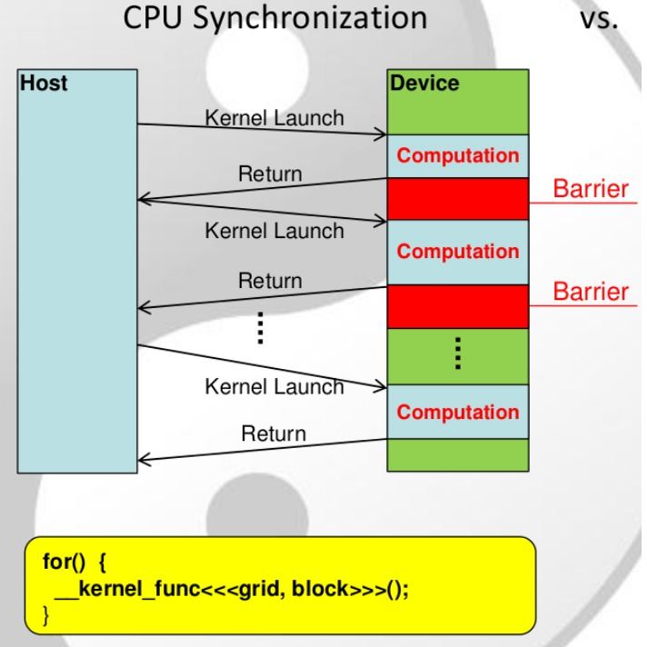
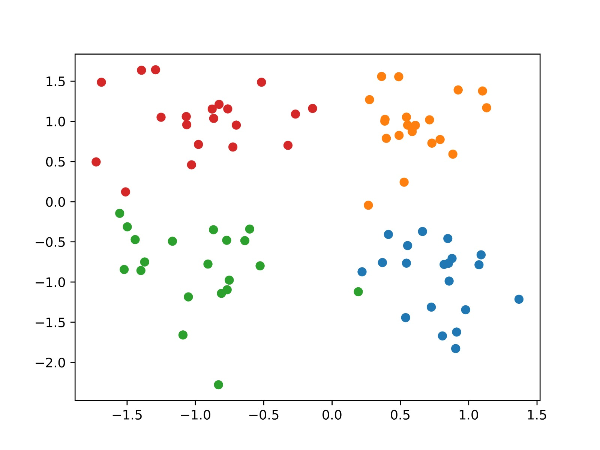
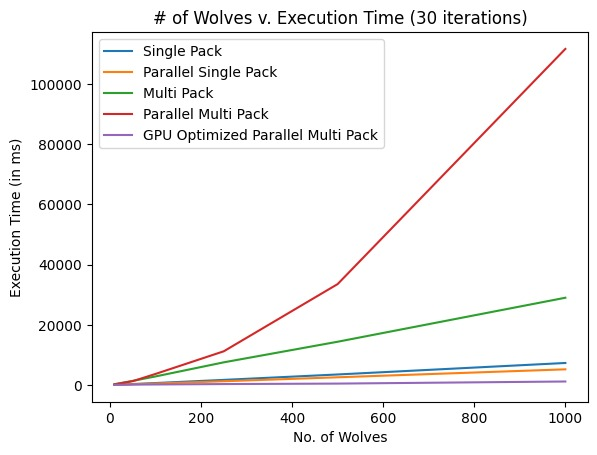
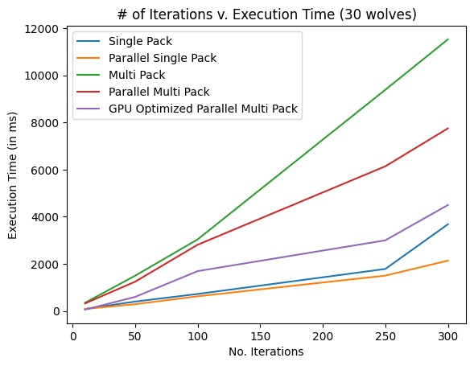
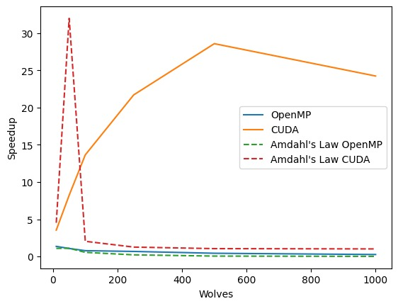
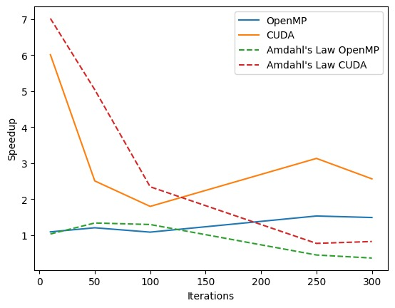

# Link

[Github](https://github.com/lemontree404/Parallel-GWO)

# Problem

Parallel Grey Wolf Optimization (GWO) algorithm with a modified approach for simultaneous identification of multiple optimal solutions. The project includes CPU multi-threading and CUDA implementations for efficient parallelization, providing accelerated convergence on both conventional multi-core processors and NVIDIA GPUs.

# Approach

OpenMP :

- Threads were initialized for each wolf and all update computations were parallelized.
- Threads were synchronized with the help of OpenMP API calls.

CUDA:

- Since built in synchronization methods were not available for CUDA, synchronzation was done implicitly using CPU synchronization

While implementing single pack gwo parallely, wolves were equally split between threads, to ensure maximum speedup. Similarly, for multiple packs, each pack was split equally among the threads.

The constructs used in this process were:

* Openmp
  * omp parallel num_threads
  * omp critical
  * omp barrier
  * omp_get_thread_num
  * omp_get_wtime
* Cuda
  * cudaMalloc
  * cudaMemcpy
  * cudaEvent
  * cudaSynchronize

# Multiple Optima Convergence

# Performance Metric

Two performance metrics were used for this project, number of iterations and number of wolves per pack

The average speed ups with regards to number of iterations can be seen below:

NOTE: Amdahl's Optimization Limit (dotted line) plotted here is only an approximation made from the program runtime.

